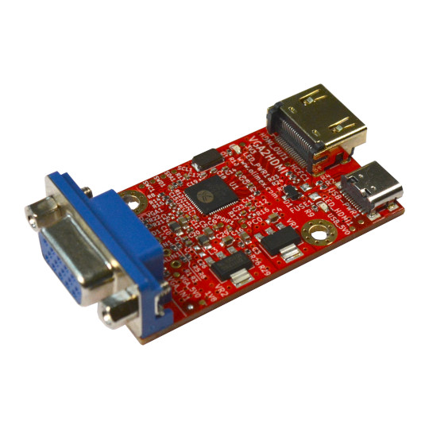

# VGA2HDMI
VGA to HDMI converter

## Features

* VGA input connector
* HDMI output connector
* USB-C for power supply
* Power supply status LED
* VGA signal status LED
* HDMI signal status LED
* Dimensions 51x33mm
* 2 mount holes

## Licenses

* Hardware is released under CERN Open Hardware Licence Version 2 - Strongly Reciprocal, all silkscreen credits to Olimex should remain;
* Documentation is released under CC BY-SA 4.0